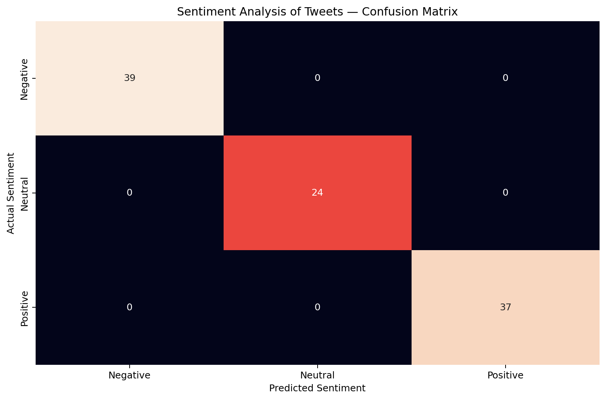

# 📸 Project Screenshots

This folder contains screenshots demonstrating the output and functionality of the **Sentiment Analysis of Tweets** project.

## 🖥️ Model Results

The screenshot below shows the model evaluation results, including dataset information, training/testing split, accuracy, classification report, and sample predictions.

## 🔍 Sentiment Predictions

The screenshot below demonstrates sentiment predictions for sample tweets using the trained machine learning model.

## 📊 Confusion Matrix

The confusion matrix shows the performance of the sentiment classification model across the Positive, Negative, and Neutral classes.

