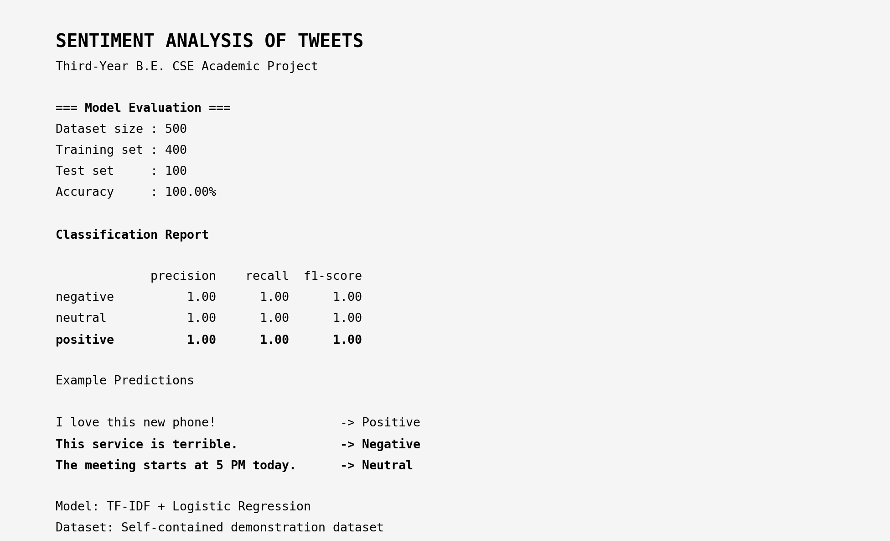
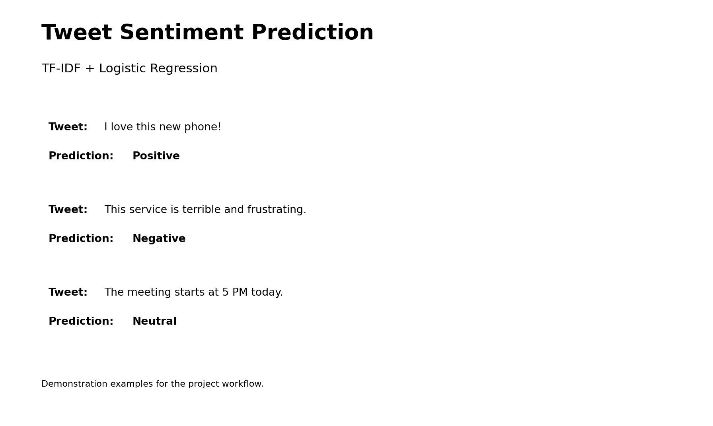

# 📸 Project Screenshots

This folder contains screenshots demonstrating the output and functionality of the **Sentiment Analysis of Tweets** project.

## 🖥️ Model Results

The following screenshot shows the model evaluation results, including the dataset information, training/testing split, accuracy, classification report, and sample predictions.

## 🔍 Sentiment Predictions

The following screenshot demonstrates sentiment predictions for sample tweets using the trained machine learning model.

## 📊 Confusion Matrix

The confusion matrix generated during model evaluation is available in the `results` folder.

[View Confusion Matrix](../results/confusion_matrix.png)
